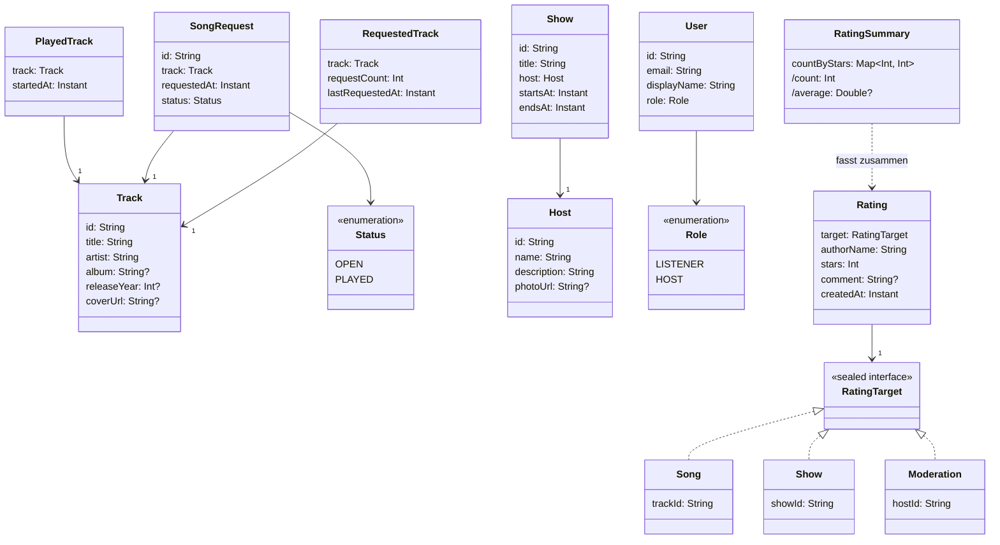

# UML

## Domänenmodell

```mermaid
classDiagram
    class Track {
        id: String
        title: String
        artist: String
        album: String?
        releaseYear: Int?
        coverUrl: String?
    }
    class PlayedTrack {
        track: Track
        startedAt: Instant
    }
    class SongRequest {
        id: String
        track: Track
        requestedAt: Instant
        status: Status
    }
    class Status {
        <<enumeration>>
        OPEN
        PLAYED
    }
    class RequestedTrack {
        track: Track
        requestCount: Int
        lastRequestedAt: Instant
    }
    class Show {
        id: String
        title: String
        host: Host
        startsAt: Instant
        endsAt: Instant
    }
    class Host {
        id: String
        name: String
        description: String
        photoUrl: String?
    }
    class User {
        id: String
        email: String
        displayName: String
        role: Role
    }
    class Role {
        <<enumeration>>
        LISTENER
        HOST
    }
    class Rating {
        target: RatingTarget
        authorName: String
        stars: Int
        comment: String?
        createdAt: Instant
    }
    class RatingTarget {
        <<sealed interface>>
    }
    class Song { trackId: String }
    class ShowTarget["Show"] { showId: String }
    class Moderation { hostId: String }
    class RatingSummary {
        countByStars: Map~Int, Int~
        /count: Int
        /average: Double?
    }

    PlayedTrack --> "1" Track
    SongRequest --> "1" Track
    SongRequest --> Status
    RequestedTrack --> "1" Track
    Show --> "1" Host
    User --> Role
    Rating --> "1" RatingTarget
    RatingTarget <|.. Song
    RatingTarget <|.. ShowTarget
    RatingTarget <|.. Moderation
    RatingSummary ..> Rating : fasst zusammen
```
